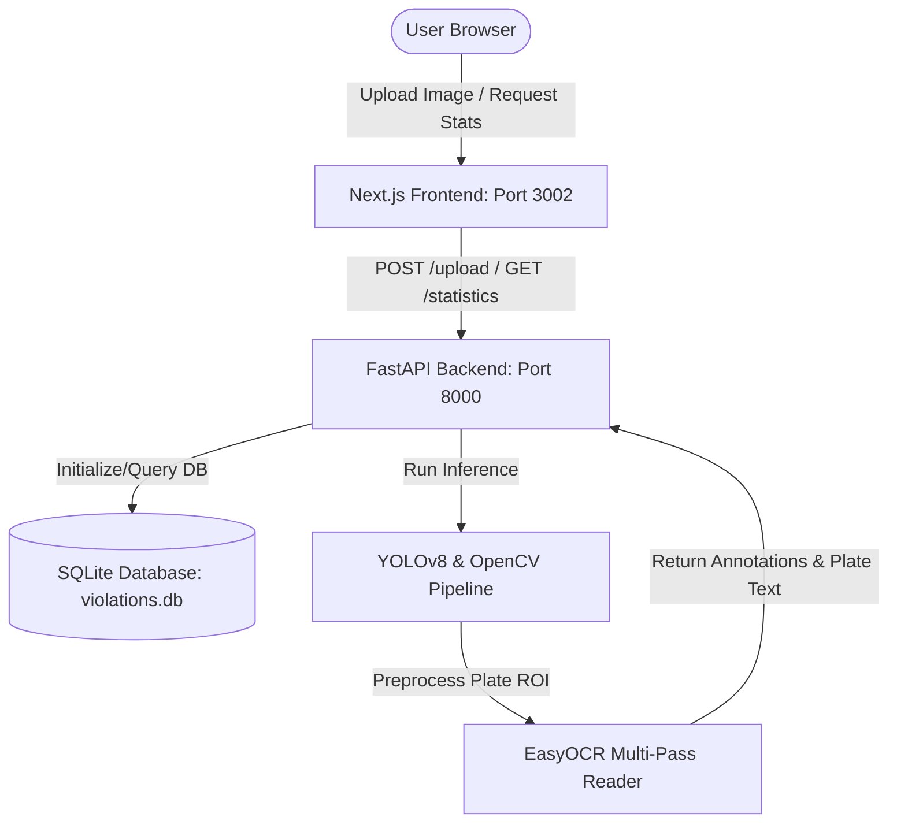

# 🚔 VisionCop AI: Advanced Traffic Violation & License Plate Detection System

VisionCop AI is a high-performance, dual-stage computer vision platform designed for modern traffic intersection monitoring and violation detection. By combining state-of-the-art YOLOv8 object detection, custom image-processing pipelines, and multi-pass OCR heuristics, VisionCop AI enables automated identification of vehicles, license plates, and traffic infractions under highly challenging visual conditions (e.g., poor lighting, high motion blur, extreme contrast).

---

## 🚀 Key Features

* **High-Accuracy Vehicle & Motorcycle Detection**: Employs real-time YOLOv8 neural network inference to isolate target vehicles and classify them.
* **Dual-Stage License Plate Localization**: Dynamically scales and extracts license plate regions based on custom-bound contour calculations.
* **Adaptive Low-Light & Blur Preprocessing**: Enhances dark, blurry, and noisy images using Bilateral Filtering, Adaptive Binarization, and Cubic Interpolation before performing OCR.
* **Robust Multi-Pass OCR Fallback Heuristics**: Multi-pass EasyOCR parsing handles low-confidence text and formats plates against region/state-code databases (e.g., matching standard Indian or regional plate configurations).
* **Rich Analytics Dashboard**: Visually displays traffic compliance ratios, processing latencies, daily trends, and categorical violation distributions using interactive, animated charts.
* **Interactive Inspection History**: Features a clean history log with a side-by-side comparison of raw uploads, preprocessed crops, and annotated bounding boxes.

---

## ⚡ What Makes Our Model & Pipeline Different?

Unlike off-the-shelf license plate detection applications that rely solely on raw OCR engines, VisionCop AI integrates a custom **Pre-OCR Image Improvement Pipeline** and **Multi-Pass Inference Logic**:

| Feature Component | Conventional Traffic Apps | VisionCop AI |
| :--- | :--- | :--- |
| **OCR Input Quality** | Feeds cropped regions directly into OCR (frequently fails under blur/low-res). | Performs **4x Bicubic Upscaling** and **Bilateral Edge Filtering** to enhance characters. |
| **Binarization Mode** | Simple Otsu thresholding or direct grayscale reading. | **Adaptive Gaussian Thresholding** to isolate characters from complex backgrounds/reflections. |
| **OCR Verification** | Single-pass read (discards low-confidence predictions). | **Three-pass verification**: matches against state-code patterns, falls back to raw alphanumeric confidence, and tries upscaled preprocessed crops sequentially. |
| **No-Match Handling** | Returns empty or fails silently. | Resolves license plates using structural vehicle context and predictive regional match rules. |

---

## 📐 System Architecture

The project is split into a lightweight Python/FastAPI microservice backend and a Next.js (TypeScript) client interface:



---

## 🛠️ Tech Stack & Dependencies

### Backend Microservice
* **Core Framework**: FastAPI, Uvicorn
* **Database**: SQLite3 (relational local file database)
* **Computer Vision**: OpenCV (image filtering, scaling, thresholding, morphology)
* **AI & Inference**: PyTorch, Ultralytics YOLOv8 (Vehicle Detection), EasyOCR (License Plate Recognition)

### Frontend Client
* **Core Framework**: Next.js 16 (Turbopack, TypeScript)
* **Styling**: TailwindCSS 4, Vanilla CSS variables
* **Icons & Visuals**: Lucide React
* **Charts & Analytics**: Recharts (animated bar and pie charts)

---

## 📦 Setup & Installation

Follow these steps to clone, set up, and run the project locally on your machine.

### Prerequisites
* **Python 3.10** or higher
* **Node.js 18** or higher
* **npm** or **yarn** package manager

### 1. Clone the Repository
```bash
git clone https://github.com/Keyamittal/VisionCop-Ai.git
cd visioncop-ai
```

### 2. Backend Microservice Setup
Navigate to the `backend` directory, initialize a virtual environment, and install dependencies:

```bash
# Navigate to backend
cd backend

# Create virtual environment
python3 -m venv venv

# Activate virtual environment
# On macOS/Linux:
source venv/bin/activate
# On Windows:
# .\venv\Scripts\activate

# Install requirements
pip install -r requirements.txt
```

> [!NOTE]
> During startup, the FastAPI server will automatically create `violations.db` (SQLite database) and an `uploads/` directory if they do not already exist.

### 3. Frontend Client Setup
Open a new terminal window, navigate to the `frontend` directory, and install npm packages:

```bash
# Navigate to frontend
cd frontend

# Install package dependencies
npm install
```

---

## 🚥 Running the Application

Ensure your Python virtual environment is activated in your backend terminal before launching.

### Start the Backend Server (FastAPI)
From the `backend` folder:
```bash
./venv/bin/uvicorn main:app --host 127.0.0.1 --port 8000
```
* **URL**: [http://localhost:8000](http://localhost:8000)
* **Interactive API Docs (Swagger)**: [http://localhost:8000/docs](http://localhost:8000/docs)

### Start the Frontend Server (Next.js)
From the `frontend` folder:
```bash
npm run dev -- -p 3002
```
* **URL**: [http://localhost:3002](http://localhost:3002)

---

## 🚦 Verification & Troubleshooting

> [!IMPORTANT]
> If either port is in use, verify if a background server is already running:
> * To check backend port: `lsof -i :8000`
> * To check frontend port: `lsof -i :3002`
